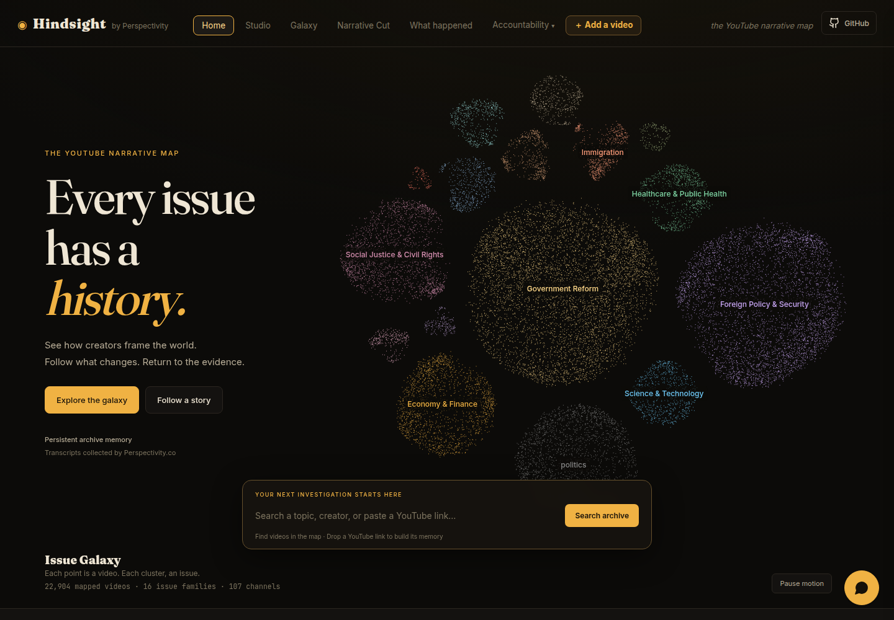
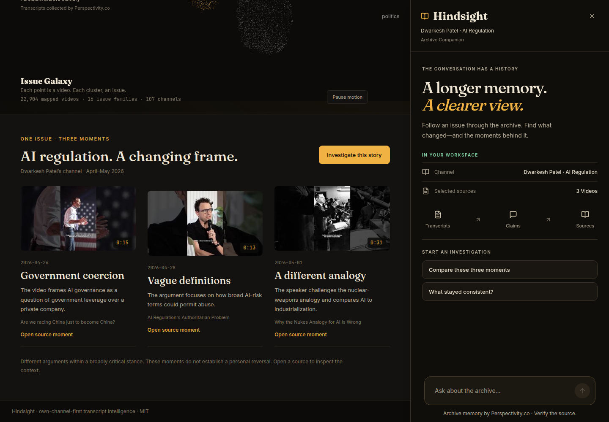
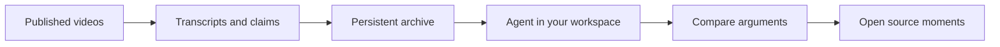

<div align="center">

# Hindsight

### Every issue has a history.

**Explore how YouTube creators frame the world—and how the conversation changes.**

[Explore the live app](https://dev.perspectivity.co/hindsight/) · [Try the agent](#follow-one-story) · [Run locally](#run-locally)

Built by [Perspectivity.co](https://perspectivity.co) · Agent work for **AI Tinkerers × OpenAI: Agents, Everywhere**

</div>



## A video is a moment. An archive is a story.

A creator returns to the same issue months later. The examples change. A guest challenges the premise. Yesterday's certainty becomes today's question.

You remember hearing something different—but finding it means hunting through hours of video.

**That is why I built Hindsight: to see how the people we watch talk about issues, how their narratives develop, and what they actually said.**

Start with an issue. Follow it across videos and dates. Open the transcript behind a claim. The interesting discovery might be a disagreement, a new argument, or a consistent concern expressed in a different way.

## A galaxy you can investigate

Every dot represents a video. Clusters group the archive into issue families.

**Hover** to discover an issue and its video count. **Click** to open that cluster in the original interactive Galaxy, where you can zoom, filter, and inspect individual videos.

The central search box accepts a topic, creator, or YouTube URL. Keywords filter the map; video links open the import flow, where you can build memory from available captions. In the Galaxy, selected clusters fit the viewport and a limited set of thumbnail markers makes individual videos recognizable.

The landing map currently contains about **23,000 videos**. The wider installation contains roughly **49,000 videos across more than 100 channels**; different views cover different subsets.

## Follow one story

The homepage offers a real starting point: **AI regulation on Dwarkesh Patel's channel.**

| April 26, 2026 | April 28, 2026 | May 1, 2026 |
|---|---|---|
| **Government coercion** | **Vague definitions** | **A different analogy** |
| How much control should government have over a private AI company? | How could broad risk categories be used to suppress models? | Is AI more like a nuclear weapon—or industrialization? |

These are interpretations of three published videos, with dates from the archive. They show different emphases within a broadly critical stance—not proof that one person reversed their position.

1. Select **Follow a story** on the homepage.
2. Choose **Investigate this story**, then **Compare these three moments**.
3. The agent reads the selected source transcripts and compares their framing.
4. Open the supporting moment, inspect its transcript, and ask a follow-up.



## An agent that knows what you are looking at

The agent shares your workspace: the selected story, sampled Galaxy sources, or the channel and draft open in the studio. You can ask about **these videos** or **this draft** without copying everything into a separate chat.

Suggested prompts help you start. Tool progress shows the work. Video cards bring evidence back into the conversation, with thumbnails, timestamp buttons, and external source links. Follow-up suggestions keep the investigation moving.

For creators, **Pre-flight** checks a draft against earlier claims in the channel's archive. The results appear beside the editor, and the creator decides what to revise or explain. The agent does not publish for you.

## A longer memory. A clearer view.

Hindsight keeps a **persistent archive memory** of transcripts, summaries, extracted claims, channel profiles, and search indexes. These survive app restarts, so an investigation can retrieve history without processing every video again.



The agent can inspect tool results and take another step before answering. Cross-session personal memory and autonomous knowledge-graph learning are future directions; they are not capabilities claimed by this demo.

## What existed—and what the hackathon adds

**All collected YouTube transcripts come from [Perspectivity.co](https://perspectivity.co) as existing work from before the hackathon.**

| Existing foundation | Hackathon agent work |
|---|---|
| Perspectivity.co's collected transcript corpus | Tool-calling agent and model-provider integration |
| Transcript processing, analysis, and retrieval engine | Streaming agent API and AG-UI browser round trips |
| Original visual studio and interactive Galaxy | CopilotKit interface, workspace context, suggestions, and evidence actions |

The narrative landing and investigation presentation connect that foundation to the agent workflow. The full corpus is **not included** in this repository. A fictional caption sample supports local setup.

<details>
<summary><strong>Under the hood</strong></summary>

Python/FastAPI serves the API and vanilla JavaScript studio. A React/CopilotKit component supplies the agent panel. Per-channel JSON under `data/` stores the archive.

- [Agent loop](hindsight/agent.py), [tools and source inspection](hindsight/agent_tools.py)
- [Plain streaming API](hindsight/agent_api.py), [AG-UI transport](hindsight/agui.py)
- [CopilotKit interface](agent-ui/src/main.jsx), [studio bridge](web/app.js)
- [Model provider](hindsight/providers.py)

Reasoning uses OpenRouter, with `openai/gpt-5.2` as the configured default. Retrieval uses Gemini embeddings to match the existing index. The web agent uses AG-UI; the CLI and plain SSE endpoint also expose the agent. The Expo mobile client provides archive browsing and creator tools; the web app is the primary demo.

</details>

## Run locally

Requires Python 3.11+ and [uv](https://docs.astral.sh/uv/).

```bash
git clone https://github.com/brishtiteveja/hindsight.git
cd hindsight
uv sync
cp .env.example .env
```

For the full agent workflow, set **`OPENROUTER_API_KEY`** for reasoning and **`GEMINI_API_KEY`** for retrieval in `.env`.

Build a small local archive from the included fictional captions:

```bash
uv run hindsight ingest samples/demo-channel --channel "Demo Channel"
uv run hindsight analyze --channel "Demo Channel"
uv run hindsight index --channel "Demo Channel"
uv run hindsight serve
```

Open **http://localhost:8300/**. Caption ingestion and serving work without model keys; analysis, indexing, and agent requests require the appropriate keys. The sample has no corresponding YouTube upload, so it demonstrates transcript processing, not real video playback. Use your own caption files or the live site for real-source exploration.

The compiled web agent is included, so Node.js is not needed just to run the app. To rebuild it after changing `agent-ui/src/`:

```bash
cd agent-ui
npm ci
npx vite build
```

For a terminal session over your indexed archive:

```bash
uv run hindsight agent --channel demo-channel "What does this archive say about AI regulation?"
```

### API entry points

| Endpoint | Purpose |
|---|---|
| `POST /v1/agent/agui` | CopilotKit/AG-UI agent stream and browser tool handoff |
| `POST /v1/agent/chat` | Plain SSE agent stream |
| `GET /v1/agent/tools` | Current tool list and execution side |
| `/docs` | Interactive FastAPI documentation |

## What to keep in mind

- Topic and stance labels are model-generated aids to exploration, not verdicts about truth or a person's beliefs.
- Speaker attribution can be uncertain. Check the original recording before saying someone reversed their position.
- Citation timestamps are retrieved estimates; inspect the surrounding transcript.
- YouTube may restrict embedded playback. The transcript and external video link provide alternative ways to inspect a source.
- This is a prototype over the indexed archive, not a complete record of everything a channel has published.

## License

MIT for the code. Third-party videos and transcripts are not relicensed by this repository.
